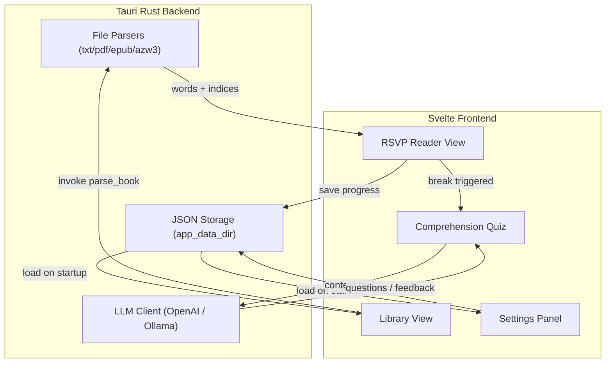

# Orpheus — RSVP Speed Reader

A fast, minimal desktop Rapid Serial Visual Presentation (RSVP) reading app. Loads books from common formats, flashes them to you one word at a time at your chosen WPM, and aligns every word around its Optimal Recognition Point (ORP) so your eye never has to move.

Built with Tauri 2 (Rust) + Svelte 5 + TypeScript for a small native binary that opens instantly.

---

## What is RSVP?

Rapid Serial Visual Presentation displays text one word at a time at a fixed point on the screen. Because your eye doesn't saccade between words, reading speed is bounded by how fast you can recognize words, not how fast you can scan a line. Most readers can comfortably sustain 400-600 WPM in RSVP with no loss of comprehension; with practice, 700-1000 WPM is achievable.

### Optimal Recognition Point (ORP)

For each word, one letter (usually the second or third) is its "visual center" — the point your eye naturally lands on to recognize the word. Orpheus highlights this letter in color and pins it to the same horizontal position on every word, so your eye stays perfectly still as words flash by.

```
  The quick  brown  fox      jumps       over    the  lazy       dog
    ^          ^      ^       ^           ^        ^   ^          ^
    └──────────┴──────┴───────┴───────────┴────────┴───┴──────────┘
                         ORP column (always at screen center)
```

---

## Tech Stack

| Layer | Tech |
|---|---|
| Desktop shell | [Tauri 2](https://tauri.app/) (Rust) — native file dialogs, parsing, persistence, LLM calls |
| UI framework | [Svelte 5](https://svelte.dev/) + TypeScript + Vite |
| Styling | Plain CSS with CSS custom properties for theming |
| Persistence | JSON files in Tauri `app_data_dir` |
| Text parsing | `pdf-extract`, `epub`, `mobi` crates |
| LLM client | `reqwest` → OpenAI-compatible HTTP API (OpenAI, Ollama) |

---

## Supported File Formats

| Format | Backend |
|---|---|
| `.txt` | UTF-8 plain text |
| `.pdf` | `pdf-extract` crate |
| `.epub` | `epub` crate (unzips + strips HTML) |
| `.azw3` / `.mobi` | `mobi` crate (best-effort) |

The Rust backend splits text into words, sentences, paragraphs, and chapters. Sentence and paragraph boundaries are used by the skip-by-sentence / skip-by-paragraph controls and by the punctuation pause engine.

---

## Project Structure

```
temp/
├── src-tauri/                  # Rust backend
│   ├── src/
│   │   ├── main.rs             # Tauri entry
│   │   ├── lib.rs              # Command registration
│   │   ├── models.rs           # Book, Settings, LibraryEntry, etc.
│   │   ├── commands/           # Tauri invoke handlers
│   │   │   ├── files.rs        # parse_book
│   │   │   ├── library.rs      # load/save library, update progress
│   │   │   ├── settings.rs     # load/save settings
│   │   │   └── llm.rs          # generate_questions, evaluate_answer
│   │   └── parsers/            # Format-specific text extraction
│   │       ├── txt.rs
│   │       ├── pdf.rs
│   │       ├── epub.rs
│   │       └── azw3.rs
│   ├── capabilities/           # Tauri permissions
│   ├── icons/
│   ├── Cargo.toml
│   └── tauri.conf.json
│
├── src/                        # Svelte frontend
│   ├── App.svelte              # Router: Library ↔ Reader
│   ├── main.ts
│   ├── app.css                 # Global CSS + theme vars
│   └── lib/
│       ├── components/
│       │   ├── RSVPDisplay.svelte       # Core word flasher w/ ORP + adjacent words
│       │   ├── Controls.svelte          # Play/pause, skip, scrub bar, WPM
│       │   ├── Library.svelte           # Book grid with progress
│       │   ├── SettingsPanel.svelte     # Tabbed settings UI
│       │   ├── ComprehensionQuiz.svelte # Break-time LLM quiz
│       │   └── ReadingStats.svelte
│       ├── stores/
│       │   ├── reader.ts                # RSVP playback state machine
│       │   ├── settings.ts              # Settings w/ Tauri persistence
│       │   ├── library.ts               # Book library store
│       │   └── theme.ts                 # CSS-var injection from theme
│       ├── utils/
│       │   ├── orp.ts                   # ORP algorithms (Spritz + Center)
│       │   ├── timing.ts                # WPM → ms, punctuation, ramp-up
│       │   ├── wordGrouping.ts          # Merge short consecutive words
│       │   └── shortcuts.ts             # Configurable keyboard manager
│       └── types.ts                     # Shared TS types
│
├── public/
│   └── favicon.svg
├── index.html
├── package.json
├── vite.config.ts
├── svelte.config.js
└── tsconfig.json
```

---

## Architecture



---

## Core Features

### RSVP Display

Each word is rendered with three segments — `before-ORP`, `ORP-letter`, `after-ORP` — in a three-column flex layout. Equal-flex halves pin the ORP letter to the exact horizontal center of the screen on every word, regardless of length.

### Adjacent Words Display

Surrounding words can be shown on either side of the current word, tinted with the muted UI color and fading out toward the screen edges via CSS gradient masks.

- **`before-orp`** uses `flex-direction: row-reverse` so overflow escapes to the left (far-past words fade out at the left edge)
- **`after-orp`** uses normal flex row so overflow escapes to the right
- The current word stays pinned at the center regardless of how long the adjacent text is

Useful for: keeping a sense of context without losing the speed benefits of RSVP.

### Skip Context

When skipping by sentence or paragraph, full-width adjacent words flash for 1.5 seconds so you can see where you landed, then disappear and playback resumes. Independent of the always-on adjacent words setting.

### Timing Engine (`reader.ts`)

Uses `setTimeout` chained per-word (not `setInterval`) so each word gets its own delay:

| Factor | Effect |
|---|---|
| Base | `60000 / WPM` ms |
| Sentence-end punctuation (`. ! ?`) | × `sentence_end_multiplier` (default 2.5) |
| Clause punctuation (`, ; :`) | × `clause_multiplier` (default 1.5) |
| Paragraph break | × `paragraph_multiplier` (default 3.0) |
| Long word (≥ threshold chars) | × `long_word_multiplier` (default 1.3) |
| Speed ramp-up | Linear interpolation from start WPM → target WPM over N seconds |
| Smart word grouping | Merges consecutive short words into one flash |

### ORP Algorithms

**Spritz-style** — anchored by word length:

| Word length | ORP index (0-based) |
|---|---|
| 1 | 0 |
| 2–5 | 1 |
| 6–9 | 2 |
| 10–13 | 3 |
| 14+ | 4 |

**Center** — `floor((length - 1) / 2)`

### LLM Comprehension Quizzes

If breaks are enabled and comprehension questions are on, when a break triggers the backend sends only the text read **since the last break** (capped by a configurable max word count in LLM settings) to the configured LLM provider and requests a mix of multiple-choice and open-ended questions. Open-ended answers are scored by a follow-up LLM call. Both OpenAI and Ollama use the same OpenAI-compatible chat-completions format, so the HTTP client code is shared.

### Reading Statistics

Tracked per session and persisted per book:
- Total words read
- Time spent reading (actual playback time, not wall clock)
- Average WPM
- Quiz score (if comprehension quizzes were taken)

### Focus Mode

Hides the top bar and all UI chrome, leaving only the RSVP word at the center of the screen. Toggled by shortcut or settings.

---

## Settings

All settings are persisted as JSON in the Tauri `app_data_dir` and edited via a tabbed settings panel. The six tabs are outlined below.

### Display

Choose from five bundled fonts (Inter, Source Sans 3, Literata, JetBrains Mono, Atkinson Hyperlegible) and set the font size. Pick between the **Spritz** or **Center** ORP algorithm, and customize how the ORP letter looks — its color, whether it's bold or underlined, and an optional size multiplier to make it larger than the surrounding text.

### Speed

**WPM** is the core setting — the target words-per-minute (50–1000), adjustable live with the arrow keys in configurable steps. The timing engine automatically pauses longer on sentence-ending punctuation, clause punctuation, and paragraph breaks, each with its own configurable multiplier. Words above a character-length threshold also get extra display time. **Speed ramp-up** optionally eases you in from a slower starting WPM, linearly ramping to your target over a set number of seconds.

### Behavior

**Adjacent words** shows surrounding words on each side of the current word while reading, with options for 1, 2, or 3 words per side, or "dynamic" which fills the available screen width. **Skip context** is an independent toggle — when you skip by sentence or paragraph, it briefly flashes full-width surrounding words for 1.5 seconds so you can orient yourself. **Smart word grouping** merges consecutive short words into a single flash. **Focus mode** strips away the top bar and all UI chrome. **Breaks** can be scheduled at a fixed interval, and during breaks you can optionally enable **comprehension questions** powered by an LLM.

### Theme

Five presets — Light, Dark, Sepia, High Contrast, and Custom. When Custom is selected (or for any preset), you can override individual colors: background, text, ORP highlight, UI accent, and guide-line color. All colors are injected as CSS custom properties.

### LLM

Configure the provider (OpenAI or Ollama), API endpoint, API key (OpenAI only), model name, and question style (multiple-choice, open-ended, or mixed). Ollama uses its local HTTP API at `localhost:11434` with the same OpenAI-compatible format, so no API key is needed.

### Keyboard Shortcuts

Every action is rebindable. Defaults: `Space` play/pause, `Arrow Left/Right` skip by sentence, `Ctrl+Arrow Left/Right` skip by paragraph, `Arrow Up/Down` adjust WPM, `F` toggle focus mode, `Ctrl+,` open settings, `Escape` return to library. Shortcuts are suppressed while typing in input fields.

---

## Development

### Prerequisites

- **Node.js** 20+
- **Rust** 1.77+ (stable)
- **OS-specific Tauri prerequisites** — see [Tauri's guide](https://tauri.app/start/prerequisites/)
  - Windows: WebView2 (pre-installed on Windows 11)
  - macOS: Xcode Command Line Tools
  - Linux: `webkit2gtk-4.1`, `libayatana-appindicator3-dev`, etc.

### Install

```bash
npm install
```

### Run in dev mode

```bash
npm run tauri dev
```

This launches Vite on port 5173 and opens the native Tauri window pointing at it. Rust recompiles on backend changes.

### Build a production binary

```bash
npm run tauri build
```

Output bundles land in `src-tauri/target/release/bundle/`.

### Frontend-only build

```bash
npm run build         # Vite → dist/
```

### Rust-only check

```bash
cd src-tauri
cargo check
```

---

## Persistence

On first run the app creates:

```
<app_data_dir>/
├── settings.json         # Settings struct
└── library.json          # LibraryEntry[] with book metadata + progress
```

Resolution of `app_data_dir` is OS-specific (Windows: `%APPDATA%\rsvp-reader`, macOS: `~/Library/Application Support/rsvp-reader`, Linux: `~/.local/share/rsvp-reader`).

Reading progress autosaves every 10 seconds while playing, and on every pause / library navigation / session end.

---

## Fonts

Five fonts are available via CSS (loaded from Google Fonts; the `<head>` includes preconnect hints in [index.html](index.html)):

1. **Inter** — clean sans-serif, excellent screen readability
2. **Source Sans 3** — humanist sans, good for long reading
3. **Literata** — designed for book reading
4. **JetBrains Mono** — monospace (most consistent ORP column, since every char is the same width)
5. **Atkinson Hyperlegible** — designed for low-vision accessibility

---

## License

This repository does not currently declare a license. Treat as proprietary unless otherwise noted.
