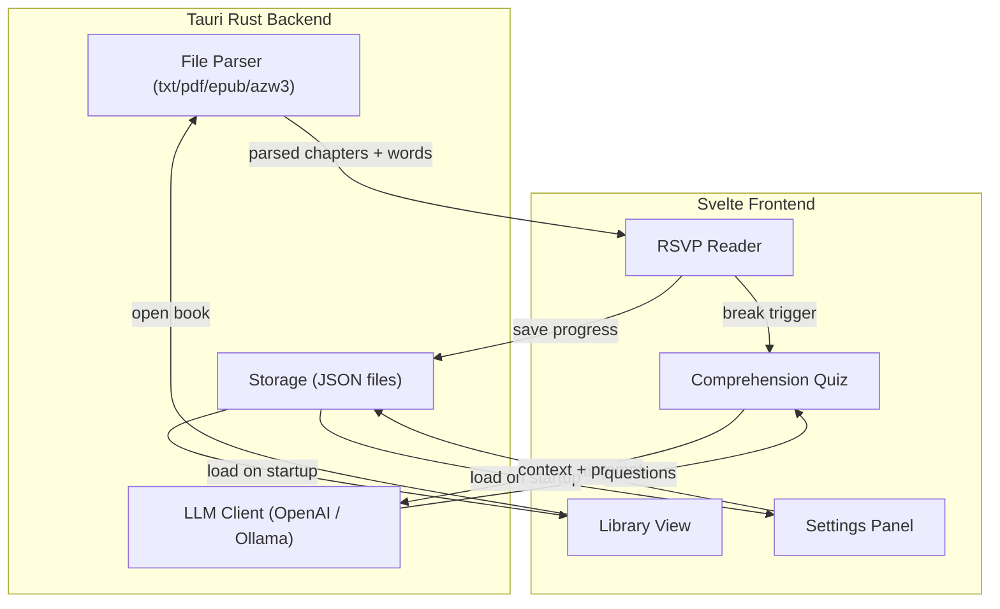

# RSVP Speed Reader (Orpheus) — Tauri + Svelte

## Tech Stack

- **Backend**: Tauri 2 (Rust) — native file dialogs, file parsing, persistence, LLM API calls
- **Frontend**: Svelte 5 + TypeScript + Vite — lightweight, compiled, fast
- **Styling**: Plain CSS with CSS custom properties for theming (no framework overhead)
- **Persistence**: Tauri `app_data_dir` via JSON files (settings, library, reading progress)
- **File parsing (Rust side)**:
  - `.txt` — trivial, read as UTF-8
  - `.pdf` — `pdf-extract` crate
  - `.epub` — `epub` crate (zip + XML parsing)
  - `.azw3` — best-effort via `mobi` crate (nice-to-have, degrade gracefully)
- **LLM**: `reqwest` in Rust for OpenAI-compatible API calls; Ollama via its local HTTP API (same OpenAI-compatible format at `localhost:11434`)

---

## Architecture



---

## Project Structure

```
rsvp-reader/
  src-tauri/
    src/
      main.rs                  # Tauri entry, command registration
      commands/
        mod.rs
        files.rs               # open_file, parse_book commands
        library.rs             # CRUD for book library + progress
        settings.rs            # load/save settings
        llm.rs                 # generate_questions command
      parsers/
        mod.rs
        txt.rs
        pdf.rs
        epub.rs
        azw3.rs
      models.rs                # Book, Chapter, Settings, LibraryEntry structs
    Cargo.toml

  src/
    lib/
      components/
        RSVPDisplay.svelte     # Core: single-word display with ORP alignment
        Controls.svelte        # Play/pause, skip, scrub bar
        ContextView.svelte     # Surrounding words overlay when skipping
        Library.svelte         # Book library grid/list
        SettingsPanel.svelte   # All settings in categorized tabs
        ComprehensionQuiz.svelte
        ReadingStats.svelte
      stores/
        reader.ts              # RSVP playback state machine
        settings.ts            # Settings with Tauri persistence
        library.ts             # Library store
        theme.ts               # CSS variable injection from theme settings
      utils/
        orp.ts                 # ORP calculation (Spritz-style + center)
        timing.ts              # WPM to ms, punctuation multiplier, long-word delay, ramp-up
        shortcuts.ts           # Configurable keyboard shortcut manager
        wordGrouping.ts        # Smart grouping of short words
      types.ts
    App.svelte                 # Router: Library view vs Reader view
    main.ts
    app.css                    # Base styles + CSS custom property definitions
  index.html
  package.json
  vite.config.ts
  svelte.config.js
```

---

## Core Component: RSVP Display with ORP Alignment

The central UI element. Each word is split into three parts: **before-ORP**, **ORP letter**, **after-ORP**. The ORP letter is positioned at a fixed horizontal anchor point (e.g., 35% from left). A vertical guide line marks the alignment point.

```svelte
<!-- Simplified concept -->
<div class="rsvp-container">
  <div class="guide-line" />
  <div class="word">
    <span class="before-orp">{beforeORP}</span>
    <span class="orp-letter">{orpChar}</span>
    <span class="after-orp">{afterORP}</span>
  </div>
</div>
```

CSS uses a fixed-width container with the ORP letter absolutely positioned at the guide line. `before-orp` is right-aligned to the guide, `after-orp` is left-aligned from it.

### ORP Algorithms

**Spritz-style** (based on word length):
| Word Length | ORP Position (0-indexed) |
|---|---|
| 1 | 0 |
| 2-5 | 1 |
| 6-9 | 2 |
| 10-13 | 3 |
| 14+ | 4 |

**Center**: `Math.floor((word.length - 1) / 2)`

User selects which algorithm in settings.

### ORP Highlight Styling (all configurable)
- Color (color picker)
- Bold toggle
- Underline toggle
- Font size multiplier (e.g., 1.0x - 1.3x relative to base)

---

## Timing Engine (`reader.ts` store)

The RSVP playback loop runs via `setTimeout` (not `setInterval`) to allow per-word timing adjustments:

1. **Base delay** = `60000 / WPM` ms
2. **Punctuation multiplier**: if word ends with `.!?` apply configurable multiplier (default 2.5x); for `,;:` apply smaller multiplier (default 1.5x); paragraph breaks get largest (default 3x)
3. **Long word delay**: words exceeding a configurable character threshold (default 8) get an additional multiplier (default 1.3x)
4. **Speed ramp-up**: if enabled, start at `startWPM` and linearly interpolate to `targetWPM` over `rampDuration` seconds
5. **Smart word grouping**: if enabled, consecutive short words (<=3 chars) are joined with a space and shown together as one "flash"

The store exposes: `currentWord`, `currentIndex`, `isPlaying`, `wpm`, `progress`, `currentSentence`, `currentParagraph`.

---

## Context View When Skipping

When the user skips (forward/back by sentence or paragraph), playback pauses and a context overlay appears for ~1.5 seconds (configurable):

- **Sentence mode**: shows the full current sentence, active word highlighted with ORP color
- **Sliding window mode**: shows ~5-7 words around current position, active word highlighted

User selects which mode in settings. After the context display timeout (or user presses play), RSVP resumes.

---

## Settings (stored as JSON, all configurable)

### Display
- Font (choice of: Inter, Source Sans Pro, Literata, JetBrains Mono, Atkinson Hyperlegible)
- Font size (14-48px)
- ORP algorithm (Spritz / Center)
- ORP highlight style (color, bold, underline, size multiplier)

### Speed
- Target WPM (50-1000, slider + number input)
- WPM adjustment step (how much up/down arrows change WPM, default 25)
- Punctuation pause multiplier (sentence-end, clause, paragraph)
- Long word threshold + multiplier
- Speed ramp-up toggle + start WPM + ramp duration

### Behavior
- Smart word grouping on/off
- Context display mode (sentence / sliding window)
- Context display duration (ms)
- Focus/zen mode toggle
- Break interval (minutes, 0 = disabled)
- Comprehension questions on/off (only when breaks enabled)

### Theme
- Preset: Light, Dark, Sepia, High Contrast
- Custom overrides: background color, text color, ORP color, UI accent color, guide line color

### LLM
- Provider: OpenAI API / Ollama
- API endpoint (default: OpenAI URL or localhost:11434)
- API key (for OpenAI)
- Model name (e.g., gpt-4o-mini, llama3)
- Question style: multiple choice / open-ended / mixed

### Keyboard Shortcuts (all rebindable)
- Play/Pause: `Space`
- Skip forward sentence: `Right`
- Skip back sentence: `Left`
- Skip forward paragraph: `Ctrl+Right`
- Skip back paragraph: `Ctrl+Left`
- Increase WPM: `Up`
- Decrease WPM: `Down`
- Toggle focus mode: `F`
- Open settings: `S` or `Ctrl+,`
- Return to library: `Escape`

---

## Book Library

- Shows all previously opened books as cards (title, author if available, progress %, last read date)
- "Open file" button triggers Tauri native file dialog with filters for .txt/.pdf/.epub/.azw3
- Clicking a book resumes from saved position
- Option to remove books from library

---

## LLM Comprehension Questions

When a break triggers (after configurable N minutes):
1. Playback pauses, break overlay appears
2. If comprehension questions enabled, Rust backend sends the last N paragraphs of read text to the configured LLM with a prompt asking for questions
3. Questions appear in a card UI — multiple choice with radio buttons, or open-ended with a text input
4. For open-ended, user's answer is sent back to LLM for evaluation, response shown
5. User clicks "Continue Reading" to resume

The LLM prompt is constructed in Rust and sent via `reqwest`. Both OpenAI and Ollama use the OpenAI-compatible chat completions format, so the same HTTP client logic works for both (just different base URLs).

---

## Reading Statistics

Tracked per session and per book:
- Total words read
- Time spent reading
- Average WPM (actual, accounting for pauses)
- Current session duration
- Comprehension quiz score (if enabled)

Shown in a small panel accessible from the reader view.

---

## Fonts

Bundle these 5 fonts as static assets (all open-source):
1. **Inter** — clean sans-serif, excellent screen readability
2. **Source Sans 3** — Adobe's open-source humanist sans
3. **Literata** — designed for long-form reading
4. **JetBrains Mono** — monospace option (best for consistent ORP alignment)
5. **Atkinson Hyperlegible** — designed for low-vision accessibility
